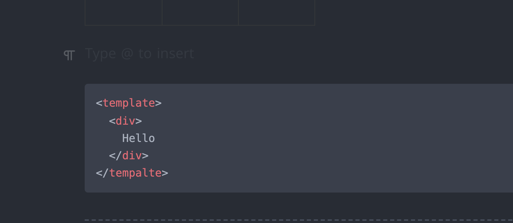

이런식으로 문서작업을 할 수 있다구!

응 너무 좋고~~

```typescript
const a = 123;
const b = 345;
// Heelo world!!
```

 $수기?$

$하이루$

- [x] 내이름은 이기훈
- [ ] 너의 이름은?
- [x] Hello!
- [x] gu!!

| 헤더1 | 헤더2 | 헤더3    |
| --- | --- | ------ |
| 값1  | 값2  | 값3     |
| 값4  | 값5  | **값6** |
|     |     |        |



```vue {1,2} title=&quot;test.vue&quot;
<template>
  <div>
    Hello
  </div>
</tempalte>

<script lang="ts" setup>
  const a = 3;
  const b = 4;
</script>

<style lang="scss" scoped>
  div {
    color: red;
  }
</style>
```

---

| 헤더1        | 헤더2    | 헤4  | 헤더3          |
| ---------- | ------ | --- | ------------ |
| 너의 그 한마디 말 |        | 더   |              |
|            |        |     | 순수한 그 모습이 나에 |
|            | 커다란 의미 |     |              |

```ts
// 코드한번 쳐볼까!!
const a = 123;
const b = 456;
```
