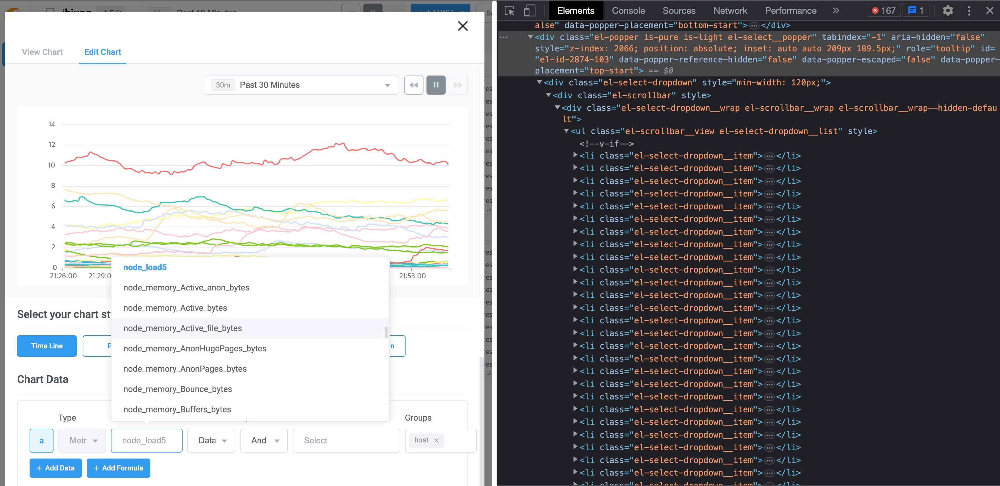

## 시작하며

> "틀린 문제에서 올바른 답은 나올 수 없다" - 영화 이상한 나라의 수학자

문제 해결 과정에서 가장 중요한 부분은, 정확한 문제의 원인을 진단하는 것입니다.

그렇기 때문에 개발 과정에서 마주칠 수 있는 여러가지 문제의 원인을 빠르고 정확하게 파악하는 방법을 익히는 것은, 개발자가 지속적으로 키워야하는 필수적인 역량이라고 생각합니다.

이 글에서 제가 Vue3를 사용한 프론트엔드 프로젝트에서 발생한 퍼포먼스 이슈의 원인을  **Chrome Devtools Performance panel** 과 **Vue Devtools Performance** 측정 기능을 활용하여 진단한 과정을 소개해드리겠습니다.

## 개요

현재 회사에서 진행하고 있는 Vue3를 사용한 대시보드 서비스 개발 중, 위젯을 설정하기 위한 다이얼로그 컴포넌트(이하 EditWidetDialog)가 나타나는 반응속도가 매우 느려지는 퍼포먼스 이슈를 발견하게 되었습니다. 해당 기능은 사용자들이 서비스에서 가장 많이 사용하는 기능 중 하나이기 때문에, 문제 해결이 필요했습니다.

웹 앱에서 퍼포먼스 저하 이슈가 발생하는 이유는 여러 가지가 있을 수 있습니다. 대부분의 경우 '긴 **스크립트** 실행 시간', '불필요한 **렌더링'**, '불필요한 **데이터 로딩**', '**큰 정적파일** 로딩'이 주요 원인입니다.

제가 겪은 퍼포먼스 이슈의 원인은 `EditWidgetDialog{:js}` 컴포넌트 내에서 매우 많은 양의 옵션을 제공하는 Select 컴포넌트가 모든 옵션 컴포넌트를 동기적으로 마운트하는 과정에서 발생한 '긴 스크립트 실행 시간'이었습니다. 

원인을 진단한 과정은 다음과 같습니다. 

1. [Chrome Devtools Performance panel](https://developer.chrome.com/docs/devtools/performance/) 을 사용하여 병목 구간 발생 원인이 '긴 스크립트 실행 시간'([Long Tasks](https://web.dev/long-tasks-devtools/))이라는 것을 알게되었습니다. 
2. [Vue Devtool](https://chrome.google.com/webstore/detail/vuejs-devtools/nhdogjmejiglipccpnnnanhbledajbpd) Performance 측정 기능을 사용하여 Long Tasks를 발생시키는 컴포넌트를 특정하였습니다. 
3. 컴포넌트 내에서 사용하는 `element-plus` 패키지 의 `ElSelect{:js}` 컴포넌트가 많은 수의 Option 과 함께 사용 시, 성능을 저하시킬 수 있다는 점을 알게되었습니다. 

## 웹 앱에서 성능이란?

> 이 부분은 웹 앱에서 성능에 대한 기본적인 관점을 제공하기 위해 작성하였습니다. [문제 발견](#문제-발견) 으로 바로 넘어가셔도 좋습니다.

웹 앱의 성능은 다양한 측면에서 평가됩니다. 대부분의 사용자는 빠른 로딩 속도와 반응성, 그리고 일관된 성능을 기대합니다. 따라서 웹 앱의 성능은 다음과 같은 요소들에 영향을 받습니다.

1. 로딩 속도: 웹 앱이 로드되는 시간은 사용자가 앱을 사용할 때 가장 먼저 인식하는 요소입니다. 로딩 속도를 개선하기 위해서는 적절한 압축 기술을 사용하고, 이미지 및 리소스를 최적화하며, CDN(Content Delivery Network)을 이용하여 캐시 기능을 활용해야 합니다.
2. 반응성: 사용자의 요청에 대한 신속한 응답이 필요합니다. 이를 위해서는 비동기 처리와 AJAX를 활용하여 페이지 전체를 새로 고치지 않고도 적절한 데이터를 받아올 수 있어야 합니다.
3. 성능 일관성: 웹 앱은 다양한 기기와 브라우저에서 동작합니다. 그러므로 앱의 성능은 일관적으로 유지되어야 합니다. 브라우저의 호환성을 고려하여 코드를 작성하고, 테스트를 통해 성능 일관성을 확인할 필요가 있습니다.
4. 메모리 사용: 웹 앱은 사용자의 디바이스에서 실행되므로, 메모리 사용을 최적화해야 합니다. 불필요한 자원 사용을 줄이고, 사용하지 않는 리소스를 제거함으로써 메모리 사용을 최적화할 수 있습니다.

그렇다면 웹 앱의 성능 목표는 어떠한 기준으로 설정하는것이 좋을까요?

### RAIL 퍼포먼스 모델


개인적으로는 유저의 경험에 대한 연구를 기반으로 사용자가 웹 앱에 가지는 기대 성능을 기준으로 하는 [RAIL 모델](https://web.dev/i18n/ko/rail/)의 목표 및 지침을 지표로 삼으면 좋다고 생각합니다. 

RAIL모델은 "Response, Animation, Idle, Load"의 약자로, 모바일 애플리케이션 및 웹사이트의 성능을 평가하고 개선하기 위한 프레임워크입니다. RAIL 모델은 구글에서 개발한 것으로, 애플리케이션의 사용자 경험을 평가하는 네 가지 요소를 정의합니다. 

궁극적인 퍼포먼스 개선의 목표를 사용자 경험의 증진이라 생각하고, 사용자 중심에서 성능을 바라보는 모델입니다. 


## 문제 발견


서비스의 특성 상 대시보드에서 데이터 시각화를 위한 다양한 위젯을 사용합니다. 퍼포먼스 이슈는 대시보드에서 위젯을 추가하는 과정에서 발생하였습니다.

대시보드에서 새로운 위젯을 추가하기 위한 단계는 다음과 같습니다.:

1. `Add Widget`(우측에 있는 파란색 버튼)을 클릭한다.
2. 1에 의해 나타난 `AddWidgetDialog{:js}` 컴포넌트에서 생성하고자하는 위젯의 타입을 선택한다.


3. 2에 의해 나타난 `EditWidgetDialog{:js}` 컴포넌트에서 어떠한 데이터를 받아올지, 받아온 데이터를 어떠한 형태로 그릴지를 설정한 뒤 저장한다.


2에서 위젯의 타입을 선택한 뒤 3의 `EditWidgetDialog{:js}`가 나타나는 시간이 오래걸리는 현상을 발견했습니다.


## 개발자 도구로 병목 구간 원인 파악하기

> #### 퍼포먼스 프로파일링
>
> 
>
> 퍼포먼스 프로파일링(Performance profiling)은 소프트웨어의 실행 시간 및 자원 사용량을 측정하고 분석하여 성능 문제를 파악하는 기술입니다. 소프트웨어의 성능을 개선하려면 어떤 부분에서 시간이 많이 소요되는지, 자원 사용량이 많은지를 파악해야 합니다. 이를 위해 퍼포먼스 프로파일링 도구를 사용하여 실행 중인 소프트웨어의 성능 데이터를 수집하고 분석합니다.

크롬 개발자 도구는 웹 앱의 퍼포먼스를 측정할 수 있는 퍼포먼스 프로파일링 기능을 제공합니다. 해당 기능을 사용해보지 않으셨다면, [공식 문서](https://developer.chrome.com/docs/devtools/performance/) 튜토리얼을 진행해보시는 것을 추천드립니다. 예제 사이트를 통해 실습을 진행하며 어느정도의 개념과 도구 사용법을 익힐 수 있는 좋은 자료입니다.

이 글에서는 개발자 도구에서 제공하는 기능이나, 퍼포먼스 프로파일링의 개념에 대해서는 자세히 다루지 않겠습니다.

### 측정 환경 설정

측정 환경은 변수를 줄이기 위해 크롬 Incognito 모드로 진행하고, 10 회 측정하였습니다.

개발자 도구 설정은 아래와 같이 진행했습니다.

> Network 패널 > Disable cache : true
>
> Performance 패널 > CPU : No throttling

네트워크 캐시 사용이 실험을 오염시킬 수 있기 때문에 Disable cache를 활성화 시켜주었습니다.

현재 개발 중인 제품은 Mobile 환경의 사용을 목표로 하지 않기 때문에, Performance Throttling은 주지 않았습니다. 


다른 위젯들의 Network 자원 사용이 변수가 될 수 있기 때문에, 테스트를 진행하기 위한 빈 대시보드를 새로 생성해 주었습니다. 


퍼포먼스 탭에서 녹화를 시작하고 `Add Widget` > `Time Line` 를 선택하여 `EditWidgetDialog{:js}`가 랜더링 된 뒤, 녹화를 종료하였습니다. 


프로파일링 결과에서 병목구간을 확인해보면, 클릭 이벤트에 따라 발생한 자바스크립트의 긴 실행(Long Task)이 원인이 되고 있다는 것을 알 수 있었습니다. 

반복 실험 후 P90(표본 중 상위 10% 위치에 있는 표본), P50(표본 중 중앙 값)을 확인해보았습니다. 평균이 아닌 P90을 확인한 이유는 서비스 관점에서 바라볼 때, 사용자 10명 중 1명이 겪는 Delay라고 가정하기 위해서 입니다. - 물론 실험 환경이 모두 동일한 PC에서 였기 때문에 실제 사용시의 P90과는 다르겠지만, 서비스의 퍼포먼스 이슈를 측정할 때는 평균보다 더 나은 지표이기 때문에 사용했습니다. 

동일한 조건으로 10회 측정 후 시간 순으로 정렬한 결과 **P90: 603ms**, **P50: 436ms**, 으로 측정되었습니다. 

| 시간      | 측정 회 차 |
| --------- | ---------- |
| 838ms     | 4          |
| **603ms** | **2**      |
| 442ms     | 10         |
| 437ms     | 7          |
| **436ms** | **1**      |
| 431ms     | 9          |
| 426ms     | 6          |
| 363ms     | 5          |
| 320ms     | 8          |
| 202ms     | 3          |


즉 제품을 사용하는 사용자 중 절반은 해당 기능을 사용할 때, 400ms 이상의 지연시간을 겪고, 사용자 중 10%는 600ms 이상의 지연을 겪을 수 있다는 것을 확인했습니다. 

### Vue Devtool을 통한 Performance 측정

Performance 패널을 통해 지연 시간의 원인이 클릭 이벤트에 따른 스크립트 실행이라는 것을 알게되었습니다. 

프로젝트 코드는 Vue로 구성되어있기 때문에, 어떤 컴포넌트 레벨에서 문제가 발생했는지를 확인하기 위해 크롬 개발자 도구를 통해서는 한계가 있었습니다.

원인이 되는 컴포넌트를 찾기 위해 [Vue Devtools](https://devtools.vuejs.org/)의 Performance 기능을 사용했습니다. React나 다른 프레임워크를 사용해서 개발 중인 프로젝트라면, 해당 프레임워크의 개발도구에서 Performance 또는 Profiler와 같은 이름의 기능이 있는지 확인해보세요. 


Profiling 결과를 확인해보니 <sup>*</sup>플레임 그래프(Flame Graph)가 위와 같은 모양으로 나타났습니다.

> #### <sup>*</sup>>플레임 그래프
>
> 플레임 그래프(Flame Graph)는 소프트웨어 프로파일링(software profiling)에서 사용되는 시각화 도구입니다. 프로파일링이란 컴퓨터 프로그램 실행 중에 발생하는 함수 호출과 같은 이벤트를 측정하여 프로그램의 실행 시간, 자원 사용 등을 분석하는 기술입니다.
>
> 플레임 그래프는 프로파일링 결과를 시각적으로 표현하여 함수 호출 흐름을 파악하기 쉽게 합니다. 가장 많은 시간이 소요된 함수는 그래프의 상단에 위치하며, 하위 함수는 하단에 위치합니다. 각 함수의 크기는 해당 함수가 소요한 시간의 양을 나타냅니다.
>
> 래퍼런스 : [brendangregg.com/flamegraphs](https://www.brendangregg.com/flamegraphs.html)


플레임 그래프의 형태를 보면 단일 이벤트가 아닌 반복적인 고드름 모양의 이벤트들이 힘을 합쳐 병목을 만들어낸 것처럼 보입니다. 첫번 째 고드름부터 확인해겠습니다. 


첫번 째 고드름을 확대시킨 그래프를 살펴보니 `ElSelect{:js}` 컴포넌트가 마운트되는 과정에서 많은 시간이 소요되고 있었습니다.

`EditWidgetDialog{:js}` 컴포넌트는 여러 옵션 중 선택을 통해 Widget을 설정하는 기능을 제공하기 때문에, 자식 컴포넌트에서 `ElSelect{:js}` 컴포넌트를 많이 사용하고 있습니다.

반복적인 고드름 패턴이 `ElSelect{:js}` 컴포넌트에 의해 발생하는지를 확인해 보기 위해, 나머지 고드름들의 끝 단을 살펴보았습니다.


예상대로 모든 고드름들에 반복적으로  `ElSelect{:js}` 컴포넌트가 존재했습니다. 이제 퍼포먼스 병목의 원인이 되는 컴포넌트는 `ElSelect{:js}` 라고 특정할 수 있게되었습니다.

그렇다면 해당 컴포넌트에서 왜 이러한 원인이 발생되는지를 더 확인해보겠습니다.


고드름의 말단을 살펴보니, 무수히 많은 작은 이벤트들이 촘촘히 발생하고 있습니다.

아마도, 성능 저하 문제는 이들이 힘을 합쳐 만들어낸 위대한 업적으로 보여집니다. 이 이벤트들이 무엇인지 더 크게 키워보았습니다.


이미지를 자세히 보니 `ElOption{:js}` 컴포넌트의 Mount 이벤트가 반복되고 있었습니다. 여기까지 확인해보니, 원인이 무엇일지 예상이 가기 시작했습니다. 


실제 `ElSelect{:js}`를 사용하여 구현한 Select 컴포넌트의 동작 예시입니다. Select를 클릭하여 나타나는 Options PopOver의 우측을 보세요. 스크롤바가 생긴게 보이시나요? 

해당 Select 컴포넌트는 API를 응답을 통해 받아온 무수히 많은 옵션 중 하나를 선택하는 기능을 합니다. 

관련 코드를 살펴봅시다.

```vue title="AppSelect.vue"
<template>
  <div>
    <ElSelect
      size="medium"
      width="100%"
      placeholder="Select"
      v-bind="$attrs"
      remote
      filterable
      :loading="isLoading"
    >
      <ElOption
        v-for="option in options"
        :key="option"
        :label="option"
        :value="option"
      />
    </ElSelect>
  </div>
</template>

<script setup lang="ts">
  interface Props {
    options: string[];
    isLoading: boolean;
  }
  defineProps<Props>();
</script>

```

prop으로 전달받은 options 배열을 `ElOption{:js}`  v-for를 통해 반복생성하여 `ElSelect{:js}`의 slot으로 전달하고 있습니다. (`ElSelect{:js}` 의 공식 사용 방식입니다)

`ElSelect{:js}` 가 어떤 방식으로 Option PopOver를 생성하는지 개발자 도구의 Elements 탭에서 확인해보겠습니다.



Element Tab을 확인해보니 `ElSelect{:js}`  컴포넌트가 마운트 될 때, Dom 트리에 `el-popper`  class의 `<div>{:html}` 엘리먼트(이하 `PopOver{:js}`)가 추가됩니다.

그리고 자식으로 전달한 option 수 만큼의  `<li>{:html}` 엘리먼트가 추가됩니다. 

`PopOver{:js}`는 최초에 인라인 스타일로  `display: none{:css}`가 적용되어있고, Select를 클릭할때 마다  `display: none{:css}` 을 인라인 스타일로 추가/제거 하는 방식으로 동작하는 원리였습니다.

이러한  `ElSelect{:js}`의 동작 방식이 매우 많은 수의 Option과 함께 사용할 경우 Long Task를 발생시키고 있었습니다. 


## 문제 해결 방법 조사

먼저 원인이 된 `ElSelect{:js}`  컴포넌트의 [공식문서](https://element-plus.org/en-US/component/select.html#select)를 확인해보았습니다.


공식문서의 Select 컴포넌트 설명을 보면, Option이 아주 많을 경우에는 다른 컴포넌트 사용을 추천하고 있었습니다.

또한, 많은 양의 Option 데이터를 로딩해서 사용하는 경우를 위해 베타 버전으로 [SelectV2 컴포넌트](https://element-plus.org/en-US/component/select-v2.html#background)를 제공하기도 합니다.

해당 이슈에 대해서 이미 라이브러리 메인테이너가 인지하고 있고 정확하게 많은 양의 옵션을 사용할 경우 다른 컴포넌트를 활용하라고 안내하고 있었습니다.

### 문제 해결

문제 해결 과정은 이 글의 주제 밖이기 때문에 짧게 넘어가겠습니다.

우리 팀은 `ElSelectV2{:js}`에 대한 사용성 테스트를 진행 한 뒤, `ElSelect{:js}`를 `ElSelectV2{:js}`로 교체하는 작업을 진행했습니다.

`ElSelectV2{:js}`는 Slot 형태로 Options을 받지 않고, Prop으로 Options 를 받아서 메모리 상에서만 데이터를 가지고 있습니다.

대신 사용자가 옵션을 선택하기 위해 PopOver를 띄울 때, 사용자에게 보여줄 몇 개의 option만 Dom에 랜더링 하는 방식으로 구현되어 있었습니다.

문제를 해결한 뒤, 동일 환경에서 퍼포먼스 측정 결과 P90 120ms 로 5배 정도의 개선효과를 볼 수 있었습니다.

## 결론

프론트엔드 프로젝트에서 성능 저하 문제를 발견했을 때, 일련의 단계로 원인을 진단하고 개선할 수 있습니다. 

1. 크롬 개발자도구의 퍼포먼스 프로파일링을 사용하여 문제 원인이 무엇인지 확인한다. 
2. 사용하는 프레임워크의 개발자도구의 퍼포먼스 프로파일링을 사용하여 문제의 원인을 좁혀나간다. 
3. 특정된 원인 지점의 코드를 분석하여, 원인을 특정한다. 
4. 개선을 위한 방법을 조사한다. 
5. 개선 방법을 적용해본 뒤, 퍼포먼스 측정을 통해 개선 전과 비교한다. 

## 마치며

개발을 하며 만나는 이슈의 원인을 빠르고 정확하게 파악하는 것은 개발자에게 중요한 능력입니다. 그렇기 때문에 대부분의 이슈의 원인을 파악하기 위한 도구들은 훌륭한 개발자들에 의해 발전되어 있습니다. 

프론트엔드 프로젝트에서 퍼포먼스 이슈가 발생했을 때는, 브라우저 개발자 도구 또는 사용하는 프레임워크의 개발자 도구에서 제공하는 Profiler를 사용해 원인을 더 빠르고 정확하게 파악할 수 있습니다. 

어디선가 이런말을 들은적이 있는거 같습니다.

>  "측정할 수 없는 것은 개선할 수 없다."

 업무를 진행할 때, 무언가를 정말로 개선하기 위해서는 올바른 측정이 선행되어야 한다는 배움을 끝으로 마칩니다.
