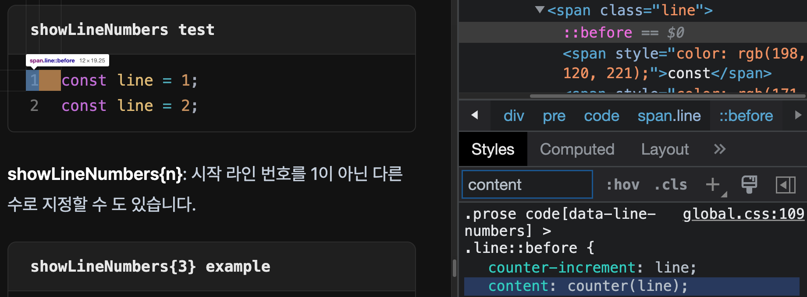

## 시작하며

개발 블로그는 코드 블록을 자주 사용하기 때문에, 마크다운의 기본적인 코드 블록 기능은 개발자들에게는 조금 아쉽게 느껴집니다. 하지만 우리는 개발자이기 때문에, 우리의 블로그의 코드블록을 커스텀하여 블로그의 코드블록을 더욱 깔끔하고 이해하기 쉽게 만들 수 있습니다.

이번 글을 통해 `rehype-pretty-code` 플러그인을 사용하여 Next.js 블로그의 코드 블록 문법을 확장하여 우리의 블로그 글을 더 아름답게 만드는 법을 알아보겠습니다.

## 코드 하이라이트 플러그인 교체 이유

저는 이 블로그의 코드 블록 표현 기능 강화를 위해 이전에 `rehype-highlight` 플러그인을 사용하고 있었습니다. 아래는 제가 `rehype-pretty-code` 로 플러그인을 변경한 이유입니다. 

1. VS Code의 모든 테마 지원 : `rehype-pretty-code`는 VS Code 의 테마 json 파일을 사용해 테마 설정이 가능합니다.
2. 문법 하이라이트 : VS Code 에서 지원하는 모든 언어에 대해서 완벽한 문법 하이라이트를 제공합니다.
3. 다양한 코드 블럭 확장 기능 제공 
   - 펜스 코드 블럭(Fenced code block)에 라인 넘버 표시기능 선택적 활성화
   - 펜스 코드 블럭의 라인 하이라이트 기능
   - 펜스 코드 블럭의 단어 하이라이트 기능
   - 인라인 코드블럭 문법 하이라이트 기능 등

제가 더 많은 코드 블록 확장 기능을 원하고 있던 것이 가장 큰 변경 이유였습니다.

## 플러그인의 역할

마크다운으로 작성한 문서를 블로그 사이트를 통해 배포하기 위해서는 마크업(html)문서로 변환하는 단계가 필요합니다. 

저는 블로그내에서 콘텐츠 관리를 위해 [contentlayer](https://www.contentlayer.dev/) 패키지를 의존성으로 사용합니다. `contentlayer`는 마크다운 문서의 마크업 변환을 위해 [mdx-bundler](https://github.com/kentcdodds/mdx-bundler) 패키지를 사용하고있습니다.

`mdx-bundler`는 내부적으로 **마크다운 문서를 해석하여 html로 변환**하는 [remark](https://github.com/remarkjs/remark) 패키지와 **html을 추상구문트리 형태의 데이터로 만들어 플러그인을 활용해 사용자가 원하는 변경을 html에 적용**하는 [rehype](https://github.com/rehypejs/rehype) 패키지를 사용해서 이 변환과정을 처리합니다.  `rehype-pretty-code` 플러그인은 `rehype` 의 변환 과정에서 코드 블럭 변환 시에 동작합니다.

즉, **플러그인의 역할 범위는 html을 변환해주는 일까지** 이기 때문에, 이 후 어떤식으로 보여지게 할지는 개발자가 **css 설정을 통해 적용**해야합니다.


## 플러그인 설정

제가 확장하고자 하는 코드 블록의 기능들은 아래와 같았습니다.

- 다크/라이트에 따라 다른 테마 적용 
- 펜스 코드 블럭(Fenced code block)에 선택적인 제목 표시 
- 선택적 줄 번호 표시
- 줄 단위 하이라이트
- 단어 단위 하이라이트
- 단어 단위 하이라이트 여러 색상 적용

### rehype-pretty-code 플러그인 옵션 설정


다음은 contentlayer 설정 파일내에서 rehype-pretty-code 플러그인을 적용한 부분입니다.

```typescript title="contentlayer.config.ts" showLineNumbers{3} {5-7,16-18,19-30,38}
...

const prettyCodeOptions: Partial<PrettyCodeOptions> = {
  theme: {
    dark: 'one-dark-pro',
    /* 💡Copy https://github.com/saicharan-m/light-plus-noctis/blob/main/themes/Noctis%20Light%2B-color-theme.json */
    light: JSON.parse(readFileSync('./code_theme/light-plus-noctis.json', 'utf-8')),
  },
  onVisitLine(node: any) {
    // Prevent lines from collapsing in `display: grid` mode, and allow empty
    // lines to be copy/pasted
    if (node.children.length === 0) {
      node.children = [{ type: 'text', value: ' ' }]
    }
  },
  onVisitHighlightedLine(node: any) {
    node.properties.className.push('line--highlighted')
  },
  onVisitHighlightedWord(node: any, id?: string) {
    node.properties.className = ['word--highlighted']

    if (id) {
      /* 💡 In markdown:' ```ts /target1/#y /target2/#b ' will highlight all matched text yellow or blue*/
      const colorClass = {
        y: 'yellow',
        b: 'blue',
      }[id]
      node.properties.className.push(colorClass)
    }
  },
}

export default makeSource({
  mdx: {
    ...,
    rehypePlugins: [
			...
      [rehypePrettyCode, prettyCodeOptions],
    ],
  },
})

```

#### 멀티 테마 적용 : 5-7번 줄

블로그가 Dark 테마를 지원하기 때문에 테마를 두가지를 사용하였습니다. `rehype-pretty-code` 는 VS-Code 중 일부를 내장 테마로 설치해두어서 5번 라인의  `dark: 'one-dark-pro'{:ts}` 처럼도 사용가능하고, 다른 테마를 사용하고 싶다면  7번 라인 처럼 vs-code 테마 중 어떤 것이든 선택하여 json 파일로 제공하면 사용가능합니다. 

#### 줄 단위 하이라이트 적용 : 16-18번 라인

`onVisitHighlightedLine(node){:ts}` 매서드는 하이라이트를 원하는 라인(node)을 만났을 때 실행되는 메서드입니다. 

매서드 내에서 `line--highlighted` 클래스를 추가해주었습니다.

#### 단어 단위 하이라이트 적용: 19-30번 라인

`onVisitHighlightedWord(node, id){:ts}` 매서드는 하이라이트를 원하는 단어(node)를 만났을 때 실행되는 메서드입니다. 여러 색상을 사용하고 싶다면 추가적으로 색상 식별자인 id를 전달할 수 있습니다. 저는 두가지 색상을 사용하기 위해 `y: 'yellow'{:ts}` 와 `b: 'blue'{:ts}`  를 지정해주었습니다. 

#### 설정한 플러그인 옵션 객체와 함께 플러그인 등록: 38번 라인

마지막으로 `rehype`에 플러그인으로 `rehype-pretty-code` 를 설정파일과 함께 등록합니다.


### html에 추가된 class에 css 스타일 적용


### 문법 하이라이팅

펜스 코드블럭 우측에 language를 명시해주면 해당 언어로 문법 하이라이트가 적용됩니다.

~~~js title="syntax highlight example"
```js
const syntax = 'highlight'
```
~~~

```js
const syntax = 'highlight'
```

플러그인이 펜스 코드 블럭에 `data-language="js"` 속성을 추가하고, 변환 과정에서 하위 노드에 language에 따라 theme에 맞는 색상을 인라인 스타일로 적용합니다. 이 과정은 내부적으로 [Shiki](https://github.com/shikijs/shiki) 를 사용해서 처리합니다. 

```html title="html" {3,4} /data-language="js"/

<div data-rehype-pretty-code-fragment>
  <pre data-language="js">
    <code data-language="js" data-theme="dark">
      <span class="line">
        <span style="color: rgb(198, 120, 221);">const</span>
        <span style="color: rgb(171, 178, 191);"> </span>
        <span style="color: rgb(229, 192, 123);">syntax</span>
        <span style="color: rgb(171, 178, 191);"> </span>
        <span style="color: rgb(86, 182, 194);">=</span>
        <span style="color: rgb(171, 178, 191);"> </span>
        <span style="color: rgb(152, 195, 121);">'highlight'</span>
      </span>
    </code>
  </pre>
</div>
```


### 코드블럭 제목

제목이 있는 코드블럭을 사용하고 싶다면  `title="file.ts"`를 추가합니다. 

~~~markdown title="title example"
```js title="file.ts"
// code
```
~~~

```ts title="file.ts"
const fileName = 'file.ts'
```

`<pre>{:html}` 태그로 시작하는 코드블럭의 위에 `data-rehype-pretty-code-title{:html}` 속성을 가진 title 요소가 추가됩니다.

```html title="html" {2} /data-rehype-pretty-code-title/
<div data-rehype-pretty-code-fragment>
  <div data-rehype-pretty-code-title data-language="ts" data-theme="dark">file.ts</div>
  <pre data-language="ts" data-theme="dark">
    <code data-language="ts" data-theme="dark">
      ...
    </code>
  </pre>
</div>
```


### 줄 번호 표시

줄 번호가 표시되는 코드블록을 사용하고 싶다면 `showLineNumbers`를 추가합니다.

~~~js title="showLineNumbers example"
```js showLineNumbers
// <code> will have attributes 'data-line-numbers'
// and 'data-line-numbers-max-digits="n"'
```
~~~

```ts showLineNumbers
const line = 1;
const line = 2;
```

`{n}`을 추가하여 시작 줄 번호를 1이 아닌 다른 수로 지정할 수 도 있습니다. (현재 이슈가 있어 정상동

~~~js title="showLineNumbers{3} example"
```js showLineNumbers{number}
// the first line of this code block will start at {number}
```
~~~

```ts showLineNumbers{3}
const line = 3;
const line = 4;
```

CSS의  [pseudo-element](https://developer.mozilla.org/en-US/docs/Web/CSS/::before) 인  `::before{:html}` 와 `counter-element`, `content` 속성을 사용해서 줄 노드에 줄 번호를 추가하는 원리로 동작합니다.



### 줄 단위 하이라이트

**\{1-3, 4}** : 중괄호 안에 라인 넘버를 적으면 해당 줄에 하이라이트가 적용됩니다. 연속된 줄은 '-' 기호로 표기합니다.

````js title="line hightlight example"
```js {1-2,4,6}
const a = 1;
const b = 2;
const c = 3;
const d = 4;
const e = 5;
const f = 6;
```
````

```ts title="{1-2,4,6} test" {1-2,4,6}
const a = 1;
const b = 2;
const c = 3;
const d = 4;
const e = 5;
const f = 6;
```


[이전 플러그인 설정](#라인-하이라이트-적용--16-18번-라인)대로 `line--highlighted` class가 목표 노드들에 적용되어있습니다.

```html
<span class="line line--highlighted">
	...
</span>
```


### 단어 단위 하이라이트

**/word/**: `/` 사이에 하이라이트 하고자하는 단어를 적습니다. 추가로 단어의 등장 순서를 적어주면 해당 순서의 단어만 하이라이트 됩니다.

````js
```js /word/2-3
let word = 0;
word = 1;
word = 2;
word = 3;
```
````

```ts title="word highlight example" /word/2-3
let word = 0;
word = 1;
word = 2;
word = 3;
```

목표 노드에 `word--highlighted` 클래스가 추가됩니다.

```html title="html" /class="word--highlighted"/
<span class="word--highlighted" style="color: rgb(250, 137, 0);">
  word
</span>
```


**/word/#id**: 이전 규칙과 동일하게 작성하고, 이어서 `#y` 와 같이 [이전](#단어-하이라이트-적용-19-30번-라인)에 설정해둔 색상 id를 기입하면 설정해둔 색상이 적용됩니다. 

````js 
```js /blue/3#b /yellow/1-2#y
blue, yellow, blue, yellow, blue, yellow
```
````


```ts title="word highlight with color example" /blue/3#b /yellow/1-2#y
blue, yellow, blue, yellow, blue, yellow
```

목표 노드에 `word--highlighted` 클래스와 함께 설정해둔 색상 클래스가 추가됩니다.

```html title="html" /class="word--highlighted yellow"/#y /class="word--highlighted blue"/#b
<span class="word--highlighted yellow" style="color: rgb(250, 137, 0);">
  yellow
</span>
...
<span class="word--highlighted blue" style="color: rgb(250, 137, 0);">
  blue
</span>
```


## 마치며


## 참조

- [rehype-pretty-plugin 공식 가이드 문서](https://rehype-pretty-code.netlify.app/)
- [mdx-bundler 깃허브 README](https://github.com/kentcdodds/mdx-bundler)
- [shiki theme 문서](https://github.com/shikijs/shiki/blob/main/docs/themes.md#dark-mode-support)
- [rehype 깃허브 README](https://github.com/rehypejs/rehype)
- [remark 깃허브 README](https://github.com/remarkjs/remark)
- [rehype-highlight 깃허브 README](https://github.com/rehypejs/rehype-highlight)
